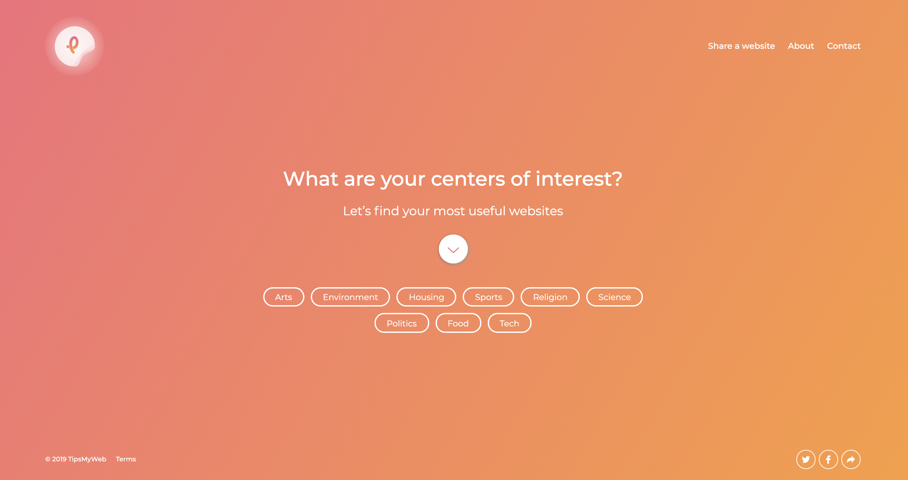

# TipsMyWeb

A simple web app to help people find useful resources for their projects.
Available at [https://tipsmyweb.com/](https://tipsmyweb.com/)



# Table of contents

- [Installation](#installation)
  * [Clone the project](#clone-the-project)
  * [Install dependencies](#install-dependencies)
  * [Add environment files](#add-environment-files)
  * [Configure a database](#configure-a-database)
  * [Launch the app](#launch-the-app)
- [Development Tools](#development-tools)
  * [Frontend development](#frontend-development)
  * [Backend development](#backend-development)

# Installation

Follow these steps to install the project from scratch.

## Clone the project

First clone the project by running the following command in the directory where you want the project to be installed.
```bash
git clone https://github.com/tipsmyweb/tipsmyweb.git
``` 

This will  create a directory named `tipsmyweb`: enter it!
```bash
cd tipsmyweb
```

## Install dependencies

### Frontend dependencies

This will install all the javascript dependencies to make the NextJS app work.

First install **Yarn** globally on your computer by following the instructions [here](https://classic.yarnpkg.com/en/docs/install/#mac-stable), then run the following:
```bash
# Get to the /frontend directory
cd frontend

# Install dependencies
yarn install
```

### Backend dependencies

This will install all the php dependencies to make the Laravel app work.

First install **Composer** in the `api` directory by following the instructions [here](https://getcomposer.org/download/), then run the following:
```bash
# Get to the /api directory
cd ../api

# Install dependencies
php composer.phar install
```

## Add environment files

### Frontend env files
Run the following to create the env files for our two frontend projects (Main & Admin apps), which will be copies of the defaults `.env.local.example` files:
```bash
# Get to the /frontend directory
cd ../frontend

# Create the env file for the two projects
cp packages/tmw-main/.env.local.example packages/tmw-main/.env.local
cp packages/tmw-admin/.env.local.example packages/tmw-admin/.env.local
```

### Backend env file
Run the following to create a `.env` file in the `api` directory, which will for now be a copy of the default `.env.example` file:
```bash
# Get to the /api directory
cd ../api


# Create the env file
cp .env.example .env
```

Later, we'll fill out this file to add database and debugging configuration.

### Add the encryption key
Laravel requires you to have an app encryption key which is generally randomly generated and stored in your `.env` file. The app will use this encryption key to encode various elements, from cookies to password hashes and more. Run the following to generate the key (still in the `/api` directory!):

```bash
php artisan key:generate
```

If you check the `.env` file again, you will see that it now has a long random string of characters in the `APP_KEY` field. We now have a valid app encryption key.

## Configure a database

### Install a database

For the app to work, you'll need a MySQL database running on your computer. There are many ways of installing such a database, but a simple solution is to install an AMP stack, which consists of a pre-configured package of a MySQL database, an interface to use the database (phpMyAdmin) and an Apache server (that we won't use here).

- **For Mac OS:** [MAMP](https://www.mamp.info/en/mamp/)
- **For Windows:** [WAMP](http://www.wampserver.com/)
- **For Linux:** *if you use linux, you already know how to do it*

Both *WAMP* and *MAMP* come with **phpMyadmin**, a web interface to control your database. That's the one you'll use to create the app's database. The default login is `root` and the default password is `password` (it can also be empty sometimes).

### Add database credentials to `.env` file

Create an empty database (you can name it `tmw` for example but the name is up to you).

In the `.env` file, fill in the `DB_HOST`, `DB_PORT`, `DB_DATABASE`, `DB_USERNAME`, and `DB_PASSWORD` options to match the credentials of the database you just created. This will allow us to run migrations in the next step.

### Migrate the database

Once your credentials are in the `.env` file, you can migrate your database (execute in `/api`):
```bash
php artisan migrate
```

This will create the tables necessary for the app to work.

### Seed the database

The database is empty for now, so you'll have to add some data through the admin interface to use the app. Later we'll add some basic random set of resources/tags that will be added automatically at the beginning.

## Launch the app

### Build the frontend

🚧 WIP 🚧

### Launch the backend server

⚠️ Before launching the backend server, make sure the mysql database is running! Then run the following in the `/api` directory:
```bash
php artisan serve --port=8000
```

This will launch the Laravel app and expose it to `http://localhost:8000`. The later part (`--port=8000`) is not necessary: the default port is `8000`. If you want to use another port, don't forget to update the `APP_URL` field in the `api/.env` file.

### Use the app

The project contains two separate sub-apps:
- The main app is the *TipsMyWeb* website, ~~which is now accessible at~~ [~~http://localhost:8000~~](http://localhost:8000)
- The admin app, where you can add, edit and delete entities such as tags and resources that are used by the main app. ~~To access the admin app, just add `/admin` to the main app's url~~ (~~[http://localhost:8000/admin~~](http://localhost:8000/admin)). The login credentials are stored in the `.env` file (`ADMIN_USERNAME` and `ADMIN_PASSWORD`).

# Development tools

## Frontend development

As you have probably seen, the app takes time to fully build and waiting this long to see your changes while developing can be quite annoying. To avoid that, the project has a second configuration that allows for a shorter build time. Run the following in `/frontend`:
```bash
yarn main-dev # This will launch the main app on http://localhost:3000
yarn admin-dev # This will launch the admin app on http://localhost:3005
```
This will launch a development server that will watch your files and update the view as soon as a change is detected. Don't forget to also launch the backend server (`php artisan serve`) as the frontend development server will still make api calls to the backend server.

If you want to change the host/port of the backend server, update the `.env.local` files in the two frontend projects.

## Backend development

Laravel comes with several tools to help with debugging php applications. To enable them, make the following updates on the `api/.env` file:
```
APP_ENV=development
APP_DEBUG=true
```

This will add a debug bar on the frontend and add additional logs to help you debug the app while developing. If you want to come back to the original configuration, set back these two params to the values they have in the `api/.env.example` file.
